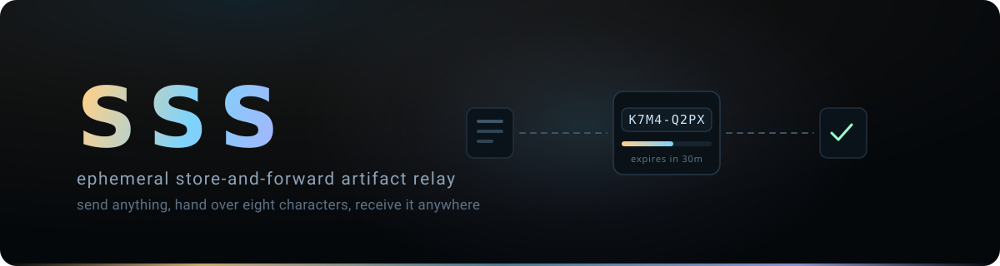

<p align="center">
  
</p>

# sss

SSS hands files between machines that are never online at the same time. One
side sends and gets eight characters back. The other side types those eight
characters and gets the files. The server holds them for half an hour and then
forgets them.

The code is a locator, not a password. Authentication is separate: one shared
base password for every trusted device, over HTTPS, with no accounts to create.

[Quick start](#quick-start) ·
[Commands](#commands) ·
[Raw curl](#raw-curl) ·
[How it works](#how-it-works) ·
[Install](docs/install/debian11.md) ·
[Operations](docs/operations/runbook.md) ·
[Release report](docs/RELEASE_REPORT.md)

```console
$ sssend ./report.pdf ./results --note "Review this" --ttl 2h
  Scanning: reading sources
  Packing: 1 pack
  Uploading: 41.8 MiB in 3 segments
  Committing: verifying on server
  Sent 41.8 MiB in 214 files; expires 2026-08-01T20:40:00Z
K7M4-Q2PX

$ ssrecv K7M4-Q2PX
/home/agent/sss-K7M4-Q2PX
```

> [!IMPORTANT]
> Anyone holding the base password can send and receive on your relay, so run it
> behind TLS and give the password only to machines you trust. Payloads are not
> encrypted at rest — the server can read them, which is exactly what makes the
> zero-copy local receive path possible.

## What it does

- **The code survives being read aloud.** Eight Base32 characters
  (`0-9 A-Z` minus `I L O U`), and the hyphen is optional when retyping.
- **A code never points at half a transfer.** It is allocated only after the
  payload is verified and published.
- **The clock starts at commit, not upload.** A slow upload does not eat into
  the recipient's window.
- **A handoff is immutable and reusable.** Many receivers, until it expires.
- **Ten thousand files cost single-digit requests.** Large files go as
  independent resumable segments, small ones as bounded `tar.zst` packs.
- **Interrupted uploads resume** from the byte the server accepted. If a source
  file changed underneath, they refuse instead.
- **The destination is never half-written.** Files land in a hidden sibling
  directory and finalize with one atomic rename.
- **Hostile paths are rejected**: symlinks, devices, sockets, FIFOs, path
  traversal, duplicates, and archive entries the manifest never declared.
- **Receiving on the server itself returns the existing path** rather than
  copying it.
- **stdout carries the code and nothing else**, so automation is a subshell
  rather than a parser.

## Quick start

Server, on Debian 11 — full walkthrough in [docs/install/debian11.md](docs/install/debian11.md):

```sh
sudo install -m 0755 sss /usr/local/bin/sss
printf '%s' 'your-base-password' | sudo sss hash-password --password-stdin
sudo editor /etc/sss/config.toml          # paste the hash
sudo systemctl enable --now sss           # binds loopback; Caddy fronts it
```

Client, anywhere:

```sh
sss configure --url https://drop.example.com
export SSS_PASSWORD='your-base-password'
sss doctor
```

`sssend`, `ssrecv`, and `sssd` are the same binary invoked under different
names — no wrapper scripts.

## Commands

```text
sss send <paths...>    upload files or directories; prints the code
sss recv <code>        download a handoff; prints the final path
sss inspect <code>     note, expiry, file count, total bytes
sss configure          save the server URL
sss doctor             config, TLS, auth, protocol, socket, admission
sss admin status       operational snapshot over the local socket
sss admin cleanup      run one cleanup pass over the local socket
sss serve              run the daemon
sss hash-password      generate the argon2id hash for the server config
sss version            version, commit, build date, protocol
```

Automation contract: stdout carries the code or the path and nothing else,
progress goes to stderr, `--json` puts exactly one object on stdout, and exit
codes are stable (`2` usage, `3` auth, `4` not found or expired, `5` network,
`6` integrity or state, `7` local filesystem, `8` server).

```sh
CODE=$(sssend build/ 2>/dev/null)
DEST=$(ssrecv "$CODE" 2>/dev/null)
```

Passwords come from `--password-stdin`, `$SSS_PASSWORD`, or a prompt — never a
`--password` flag, which would land in shell history and `ps`.

## Raw curl

Installing the CLI is optional; the HTTP interface is the product.

```sh
# send
curl -fsS -u sss -F "file=@report.pdf" https://drop.example.com/s
# K7M4-Q2PX

# send several, with a note and a TTL in minutes
curl -fsS -u sss -F "file=@a.pdf" -F "file=@b.csv" \
     -F "note=Review these" -F "ttl=120" https://drop.example.com/s

# stream something that never touches disk
tar -C ./project -czf - . |
  curl -fsS -u sss -H "X-SSS-Filename: project.tar.gz" \
       --data-binary @- https://drop.example.com/s/raw

# receive: one file comes back raw, anything else as a zip
curl -fS -u sss -OJ https://drop.example.com/r/K7M4-Q2PX
curl -fsS -u sss "https://drop.example.com/r/K7M4-Q2PX?format=tar" | tar -xf - -C received
```

On the server itself, receipt is a metadata lookup — no download, no second copy:

```sh
curl -fsS --unix-socket /run/sss/sssd.sock http://localhost/local/r/K7M4-Q2PX
# /srv/sss/live/7c/t-9b38.../payload
```

## How it works

One Go binary. SQLite holds metadata, the filesystem holds bytes, and nothing
else runs.

```text
/srv/sss/staging/<transfer-id>/   in progress — never addressable by a code
/srv/sss/live/<shard>/<id>/       committed, verified, read-only
/srv/sss/trash/<id>/              awaiting recursive deletion
```

Commit order: verify every digest, materialize the payload, write and fsync the
manifest, seal it read-only, atomically rename `staging` into `live`, then
allocate the code and mark it committed in one database transaction. A crash
between the rename and the transaction is completed idempotently at startup;
anything that cannot be proven complete is failed and trashed. Deletion is the
same move in reverse — rename into `trash`, delete outside the request path — so
a large delete never blocks traffic and never exposes a half-deleted payload.

Detail: [architecture](docs/handoff/ARCHITECTURE.md) ·
[storage and lifecycle](docs/handoff/contracts/storage-lifecycle.md) ·
[implementation decisions](docs/adr/0001-implementation-choices.md)

## What it will not become

No accounts, roles, dashboard, folder sync, P2P transport, object storage,
plugins, previews, or content indexing. A feature belongs here only when leaving
it out would damage simplicity, reliability, transfer speed, agent automation,
cross-platform behavior, or the zero-copy local path.

## Development

```sh
make check     # go vet + unit, black-box, and fault-injection suites
make race      # the same suites under the race detector
make cross     # cross-compile every release platform
make release   # binaries, alias shims, SHA256SUMS, release manifest
make smoke     # contract smoke test against $SSS_URL
```

Builds are CGO-free, so Linux and Windows binaries cross-compile without a C
toolchain. Tests are layered: pure rules as unit tests, repository correctness
against real SQLite and temp filesystems, user-visible behavior through HTTP,
the Unix socket, and the CLI in [`integration/blackbox`](integration/blackbox),
and crash boundaries in [`integration/faults`](integration/faults).

## Known limits

- Directories, regular files, modification times, and the executable bit survive
  a round trip. Symlinks, hardlink identity, ACLs, ownership, extended
  attributes, and alternate data streams do not.
- No end-to-end encryption in v1.
- A crash during server-side materialization fails that transfer and the sender
  resends; uploads themselves resume from the accepted offset.
- Small-file packs are stored twice — once as the wire segment, once extracted.
  Large files are never duplicated.
- Single host by design.
- Native Windows CI has not been run; the binaries cross-compile and path rules
  are unit-tested, but the Windows↔Linux matrix is unsigned.
