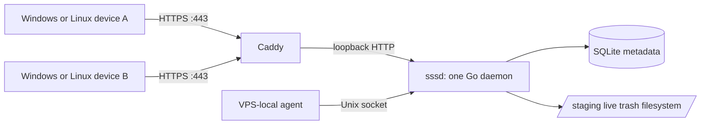
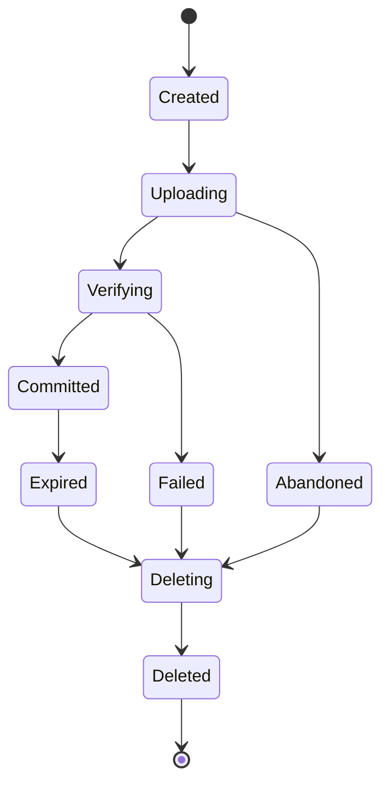

# Architecture

## 1. Architectural shape

SSS is one public HTTPS service and one local Unix-socket service backed by SQLite and a single filesystem.



### Components

| Component | Responsibility |
|---|---|
| Caddy | TLS termination and reverse proxy |
| `sssd` | HTTP API, local API, lifecycle, transfer processing, cleanup |
| SQLite | Small metadata, state, reservations, claims |
| Filesystem | Payloads, packs, staging, committed data, trash |
| `sss` | Cross-platform client and server command |
| `sssend` / `ssrecv` | Thin aliases or shims |

There is no second application service.

## 2. Planes

### Control plane

Handles authentication, transfer creation, metadata, commit, code allocation, claim creation, expiry, and admin status.

Control messages are JSON except for deliberately plain simple endpoints.

### Data plane

Handles:

- streaming multipart/raw simple uploads;
- resumable segment uploads;
- range-capable segment downloads;
- streaming raw/ZIP/TAR simple downloads.

Data bytes are never stored in SQLite.

### Local plane

The Unix socket:

```text
/run/sss/sssd.sock
```

allows a VPS-local client to:

- claim a code;
- retrieve the existing committed payload path;
- optionally send without routing through public HTTPS;
- query local status.

Access is controlled by Unix owner/group permissions.

## 3. Runtime model

One Go process contains bounded subsystems:

```text
HTTP listeners
├── public loopback listener
└── Unix-socket listener

Transfer engine
├── simple upload handler
├── resumable upload handler
├── verifier
├── materializer
├── claim/download handler
└── archive streamer

State services
├── SQLite repository
├── filesystem repository
├── disk admission controller
├── lease manager
├── janitor
└── startup reconciler
```

Use bounded worker pools or semaphores for CPU- and disk-intensive tasks. Do not spawn unbounded goroutines per file.

## 4. Storage layout

```text
/var/lib/sss/
└── sss.db

/srv/sss/
├── staging/
│   └── <transfer-id>/
│       ├── transfer.json
│       ├── payload/
│       ├── segments/
│       └── packs/
├── live/
│   └── <two-character-shard>/
│       └── <transfer-id>/
│           ├── manifest.json
│           ├── payload/
│           └── packs/
└── trash/
    └── <transfer-id>/

/run/sss/
└── sssd.sock
```

`staging`, `live`, and `trash` must be on the same filesystem so directory renames are atomic.

## 5. Transfer state machine



Only `Committed` transfers have a public short code.

Suggested database states:

```text
CREATED
UPLOADING
VERIFYING
COMMITTED
EXPIRED
DELETING
DELETED
FAILED
ABANDONED
```

State transitions are explicit and idempotent.

## 6. Commit protocol

SQLite and the filesystem cannot participate in one true transaction, so publication must be recoverable rather than pretending to be atomic across both.

Recommended order:

1. Finish all staged writes.
2. Verify segment and file digests.
3. Materialize the final payload.
4. Write and fsync the final manifest.
5. Make the staged payload immutable/read-only.
6. Atomically rename the transfer directory from `staging` to `live`.
7. In one SQLite transaction:
   - allocate a unique short code;
   - set `committed_at`;
   - set `expires_at = committed_at + requested_ttl`;
   - set state to `COMMITTED`.
8. Return the code.

Startup reconciliation handles a live directory whose database commit was interrupted:

- if the manifest is valid and the database record is pre-commit, complete the idempotent commit;
- if the directory is invalid, move it to trash and mark failed;
- never expose a code before the database says committed.

The implementation may use another ordering only if it proves an equally clean recovery invariant. The externally visible invariant is non-negotiable: no code resolves to incomplete data.

## 7. Deletion protocol

1. Deny new claims once expired.
2. Wait until active claim leases end.
3. Set state to `DELETING`.
4. Atomically rename the live directory to `trash`.
5. Delete recursively outside request handling.
6. Remove or tombstone database records.
7. Mark `DELETED`.

A large recursive delete must not block request handlers or leave partially visible live content.

## 8. Transfer representation

### Simple HTTP path

`POST /s` writes multipart files directly into a staged payload tree while hashing.

`POST /s/raw` writes one named stream.

The server owns packing and materialization details. This path is deliberately non-resumable and optimized for zero-install use.

### Advanced CLI path

The client creates a manifest and a hybrid segment plan.

#### Raw segments

Large regular files are sent directly as independent resumable segments.

#### Small-file packs

Small files are grouped into bounded `tar.zst` packs.

Initial internal targets:

- files below roughly 1 MiB are pack candidates;
- packs target roughly 64 MiB uncompressed;
- four concurrent segment transfers.

These are implementation defaults, not normal user settings. Benchmark and adjust without changing the protocol contract.

### Materialization

Before commit, the server:

- places raw segments into the staged payload;
- extracts pack segments safely;
- verifies every manifest entry;
- applies portable modification time and executable bits;
- rejects traversal, duplicate paths, unsupported entry types, and size/count violations;
- publishes the immutable payload.

Raw large files should not be duplicated when the staged segment can become the materialized file through rename or link semantics.

## 9. Advanced resumability

Use a tus-compatible offset protocol:

- creation returns upload resource IDs;
- `HEAD` returns accepted offset and length;
- `PATCH` appends from the exact offset;
- mismatched offsets return conflict;
- each segment is independently resumable;
- commit is idempotent.

Downloads use HTTP range requests on immutable segments.

The client stores resumable state under platform-appropriate state/cache directories. A rerun finds an incomplete session only when source identity and metadata still match.

## 10. Database model

### `transfers`

```text
id TEXT PRIMARY KEY
code TEXT UNIQUE NULL
state TEXT NOT NULL
sender_label TEXT NULL
created_at INTEGER NOT NULL
committed_at INTEGER NULL
expires_at INTEGER NULL
requested_ttl_minutes INTEGER NOT NULL
note TEXT NULL
manifest_digest TEXT NULL
wire_bytes INTEGER NOT NULL
materialized_bytes INTEGER NOT NULL
reserved_bytes INTEGER NOT NULL
root_path TEXT NOT NULL
last_error_code TEXT NULL
```

### `segments`

```text
id TEXT PRIMARY KEY
transfer_id TEXT NOT NULL
kind TEXT NOT NULL
expected_length INTEGER NOT NULL
received_length INTEGER NOT NULL
digest_algorithm TEXT NOT NULL
expected_digest TEXT NULL
state TEXT NOT NULL
relative_storage_path TEXT NOT NULL
```

### `claims`

```text
id TEXT PRIMARY KEY
transfer_id TEXT NOT NULL
kind TEXT NOT NULL
created_at INTEGER NOT NULL
lease_until INTEGER NOT NULL
completed_at INTEGER NULL
token_hash TEXT NULL
```

### `idempotency_keys`

```text
key_hash TEXT PRIMARY KEY
operation TEXT NOT NULL
transfer_id TEXT NULL
response_code TEXT NULL
created_at INTEGER NOT NULL
expires_at INTEGER NOT NULL
request_fingerprint TEXT NULL
```

File listings live in `manifest.json`, not one row per file.

## 11. Authentication

Public endpoints use a single configured base password through HTTP Basic auth over TLS.

- fixed username: `sss`;
- server stores only a memory-hard password hash;
- authentication comparison does not leak useful timing;
- password and Authorization header are never logged;
- rate limiting protects repeated failures;
- local Unix-socket requests authenticate through filesystem permissions.

Do not add account state in v1.

## 12. Disk admission and backpressure

Advanced transfer creation declares expected sizes and receives a reservation.

Simple streaming uploads may not know final length. They are accepted only while the server remains below the configured high-watermark.

The admission controller considers:

- filesystem free bytes;
- outstanding reservations;
- expected materialization overhead;
- configured maximum transfer size;
- configured high-watermark.

On pressure:

- reject new transfers;
- continue existing downloads;
- run cleanup;
- never publish partial content;
- return `INSUFFICIENT_STORAGE`.

## 13. VPS-local claims

A local claim returns the committed payload path and records a cleanup grace lease.

Properties:

- no second data copy;
- payload is read-only;
- multiple local readers are allowed;
- cleanup waits for the fixed lease/grace;
- a caller needing writable or long-lived files copies or reflinks via `--to`.

The raw local endpoint returns plain text by default and JSON under `Accept: application/json`.

## 14. Concurrency and shutdown

- Bound simultaneous uploads, downloads, verification workers, and archive streams.
- Propagate request cancellation.
- Graceful shutdown stops accepting new work, lets bounded active requests finish, persists offsets, and exits within a configured deadline.
- Startup always runs reconciliation before declaring readiness.
- `/healthz` reports liveness; `/readyz` reports reconciled readiness.

## 15. Observability

Keep observability small:

- structured logs to stdout/journald;
- request ID;
- transfer ID and code only where safe;
- state transitions;
- byte counts and durations;
- cleanup results;
- disk admission status;
- `sss admin status`;
- `/healthz` and `/readyz`.

Prometheus is optional and should not block v1.

## 16. Scaling boundary

This architecture is intentionally single-host.

Only introduce object storage when there is evidence of:

- disk capacity pressure that cannot be solved by a larger volume;
- multiple server nodes;
- geographic distribution;
- transfer volume that makes local storage operationally unreasonable.

The public contracts should survive that later transition, but v1 must not implement it.
